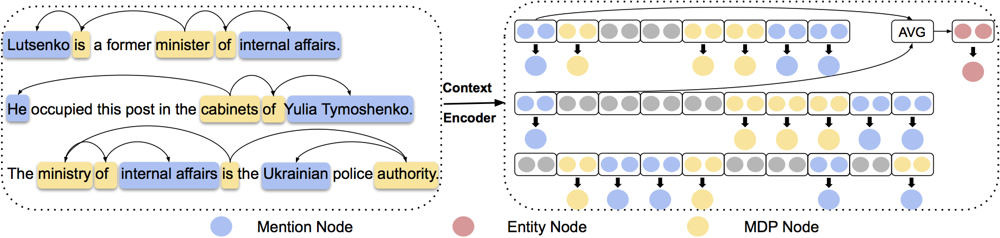
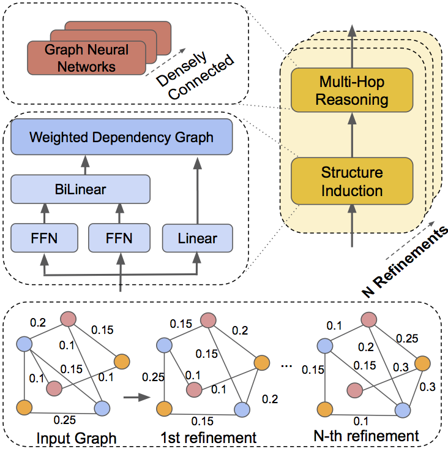

# LSR
This repository is the PyTorch implementation of our LSR model with GloVe embeddings in ACL 2020 Paper 
"[Reasoning with Latent Structure Refinement for Document-Level Relation Extraction](https://arxiv.org/abs/2005.06312)".

# Requirement
```
python==3.6.7 
torch==1.3.1 + CUDA == 9.2 1.5.1
OR torch==1.5.1 + CUDA == 10.1
tqdm==4.29.1
numpy==1.15.4
spacy==2.1.3
networkx==2.4
```
# Overview of LSR

**Node construtor**:


Overview of the Node Constructor: A context encoder is applied to get the contextualized representations of sentences. The representations of mentions and words in the meta dependency path are extracted as mention nodes and MDP nodes. An average pooling is used to construct the entity node from the mention nodes. For example, the entity node *Lutsenko* is constructed by averaging representations of its mentions *Lutsenko* and *He*.

**Dynamic Reasoner**:
<p align="center">

</p>
Overview of the Dynamic Reasoner. Each block consists of two sub-modules: structure induction and multi-hop reasoning. The first module takes the nodes constructed by the Node Constructor as inputs. Representations of nodes are fed into two feed forward networks before the bilinear transformation. The latent document-level structure is computed by the Matrix-Tree Theorem. The second module takes the structure as input and updates representations of nodes by using the densely connected graph convolutional networks. We stack $N$ blocks which correspond to $N$ times of refinement. Each iteration outputs the latent structure for inference.

# Dataset

For the dataset and pretrained embeddings, please download it [here](https://github.com/thunlp/DocRED/tree/master/data), which are officially provided by [DocRED: A Large-Scale Document-Level Relation Extraction Dataset](https://arxiv.org/abs/1906.06127)
. 
# Data Proprocessing
After you download the dataset, please put the files train_annotated.json, dev.json and test.json to the ./data directory, and files in pre directory to the code/prepro_data. Run:

```
# cd code
# python3 gen_data.py 
```

# Training
In order to train the model, run:

```
# cd code
# python3 train.py
```

# Test
After the training process, we can test the model by:

```
python3 test.py
```

## Related Repo

Codes are adapted from the repo of the ACL2019 paper DocRED [DocRED: A Large-Scale Document-Level Relation Extraction Dataset](https://github.com/thunlp/DocRED).

## Citation

```
@inproceedings{nan2020lsr,
 author = {Guoshun, Nan and Zhijiang, Guo and  Ivan, Sekulić and Wei, Lu},
 booktitle = {Proc. of ACL},
 title = {Reasoning with Latent Structure Refinement for Document-Level Relation Extraction},
 year = {2020}
}
```


